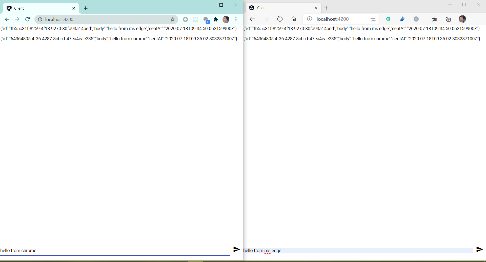

# Building a Chat application with Angular and Spring Reactive WebSocket


[Spring WebFlux as a new module introduced in Spring  5.0](https://medium.com/@hantsy/reactive-programming-with-spring-5-3bfc5d324ba0) which provides a new programming model for developers, most of the features existed in Spring WebMVC have been ported to the WebFlux stack, including WebSocket support.

WebSocket is a standalone spec defined in [RFC6455 ](https://tools.ietf.org/html/rfc6455), which provides bi-direction none-blocking communication between clients and server side. 

In this post, we will start creating a simple chat application which uses Spring WebFlux based WebSocket APIs to build the server side, and uses Angular as client to communicate with the server side.  Initially we will use a Reactor specific Sink  as the message queue, and then we will switch to use the trailable cursor on the capped collections in MongoDB to simplify the work.  

As introduced in [my original post](https://medium.com/@hantsy/reactive-programming-with-spring-5-3bfc5d324ba0) , Spring WebFlux embraces [ReactiveStreams](https://www.reactive-streams.org/) spec, heavily depends on [Project Reactor](https://projectreactor.io/) . The  WebSocket API in Spring WebFlux is not so rich as the one in Spring WebMVC, eg. it lacks general controller support and does not support to adapt the STOMP protocol. In the Google result of "spring webflux websocket", you will find most of the solutions are based on the Reactor 's  Processor, eg. [How To Build a Chat App Using WebFlux, WebSockets & React ](https://blog.monkey.codes/how-to-build-a-chat-app-using-webflux-websockets-react/)  is  a great article to introduce the usage of  WebSocket in  Spring WebFlux, for more info about the `UnicastProcessor` and other processors in Reactor, check [How to use Processor in Reactor Java](https://ducmanhphan.github.io/2019-08-25-How-to-use-Processor-in-Reactor-Java) from [Manh Phan](http://ducmanhphan.github.io).

Firstly let's create the server side. Generate a project skeleton using [Spring Initializr](https://start.spring.io).

* Project type: Gradle
* Language: Kotlin
* Spring Boot version :2.4.0M1
* Project Metadata/Java: 14
* Dependencies: Reactive Web

Hit the **Generate** button to download the generated archive,  and extract it into your local disk.

Make sure you have installed the latest JDK ([AdoptOpenJDK]( https://adoptopenjdk.net/) is highly recommended) 14,  then import the source codes into your favorite IDE, eg. Intellij IDEA. IDEA will resolve the dependencies and build the project automatically.

To enable WebSocket in Spring WebFlux application, just declare a simple `WebSocketHandlerAdapter` bean.

```kotlin
@Bean
fun handlerAdapter(): WebSocketHandlerAdapter = WebSocketHandlerAdapter()
```

And set up the WebSocket endpoints in a `HandlerMapping` bean.

```kotlin
@Bean
fun webSocketMapping(mapper: ObjectMapper): HandlerMapping? {
    val map = mapOf("/ws/messages" to ChatSocketHandler(mapper))
    val simpleUrlHandlerMapping = SimpleUrlHandlerMapping().apply {
        urlMap = map
        order = 10
    }
    return simpleUrlHandlerMapping
}
```

Here we will use a custom `ChatSocketHandler` to receive from and send message to the endpoint */ws/messages*. WebSocket supports text and binary based payload in the message,  here we only use text message, we will convert our message to json string by  Jackson `ObjectMapper`.

Let's have a look at the complete codes of `ChatSocketHandler`.

```kotlin
class ChatSocketHandler(val mapper: ObjectMapper) : WebSocketHandler {
    val sink = Sinks.replay<Message>(100);
    val outputMessages: Flux<Message> = sink.asFlux();

    override fun handle(session: WebSocketSession): Mono<Void> {
        println("handling WebSocketSession...")
        session.receive()
                .map { it.payloadAsText }
                .map { Message(id= UUID.randomUUID().toString(), body = it, sentAt = Instant.now()) }
                .doOnNext { println(it) }
                .subscribe(
                        { message: Message -> sink.next(message) },
                        { error: Throwable -> sink.error(error) }
                );

        return session.send(
                Mono.delay(Duration.ofMillis(100))
                        .thenMany(outputMessages.map { session.textMessage(toJson(it)) })

        )

    }

    fun toJson(message: Message): String = mapper.writeValueAsString(message)

}
```

The `ChatSocketHandler` implements `WebSocketHandler` interface,  in the handle method, it will shakehands with a WebSocket client when it is connected. Here when receiving a message from  a WebSocket client,  we will cache it into a *replayable* [`Sinks.StandaloneFluxSink` ](https://projectreactor.io/docs/core/snapshot/api/reactor/core/publisher/Sinks.html), and retrieve the messages from our former Sink, and send the cached messages back to the WebSocket client.

> The `UnicastProcessor` and `ReplayProcessor` , etc. are marked as deprecated in the latest version,  so here we use the newest `Sinks` instead.

Declare a simple POJO to present the WebSocket message payload in a chat application.

```kotlin
data class Message @JsonCreator constructor(
        @JsonProperty("id") var id: String? = null,
        @JsonProperty("body") var body: String,
        @JsonProperty("sentAt") var sentAt: Instant = Instant.now()
)
```

Jackson `ObjectMapper` requires a  none-arguments constructor or a `JsonCreator` annotated constructor when serializing an object.

Now run the server application by clicking the *Run* icon besides the `main` fun in the editor of IDEA  or executing the following command .

```bash
./gradlew bootRun

Starting a Gradle Daemon (subsequent builds will be faster)

> Task :bootRun

  .   ____          _            __ _ _
 /\\ / ___'_ __ _ _(_)_ __  __ _ \ \ \ \
( ( )\___ | '_ | '_| | '_ \/ _` | \ \ \ \
 \\/  ___)| |_)| | | | | || (_| |  ) ) ) )
  '  |____| .__|_| |_|_| |_\__, | / / / /
 =========|_|==============|___/=/_/_/_/
 :: Spring Boot ::             (v2.4.0-M1)

2020-07-18 13:57:57.002  INFO 14776 --- [           main] c.e.demo.WebSocketServerApplicationKt
...
<==========---> 80% EXECUTING [1m 1s]
> :bootRun

```

Let's move to the frontend building - creating a simple Angular app to shake hands with the server side.

I assume you have installed the latest [NodeJS](https://www.nodejs.org) and [Angular CLI](https://cli.angular.io).

Follow the official [Getting started](https://angular.io/guide/setup-local) guide to setup Angular environment and create a new project. Then open it in  your favorite IDEs, eg.  [VS Code](https://code.visualstudio.com).

We do not make things complex, and contribute codes in the top-level `AppComponent` directly.

```typescript
export class AppComponent implements OnInit, OnDestroy {
  title = 'client';
  message = '';
  messages: any[];
  socket: WebSocket;

  constructor(private zone: NgZone) {
  }

  ngOnInit(): void {
    this.messages = [];
    this.socket = new WebSocket("ws://localhost:8080/ws/messages");
    this.socket.onmessage = event => {
      console.log('onmessage:' + event)
      this.zone.run(() => {
        this.addMessage(event.data);
      })
    }
  }

  addMessage(msg: any) {
    this.messages = [...this.messages, msg];
    //console.log("messages::" + this.messages);
  }

  ngOnDestroy(): void {
  }

  sendMessage() {
    console.log("sending message:" + this.message);
    this.socket.send(this.message);
  }
}
```

Here we initialize a WebSocket connection in the `ngOnInit` method,  and listen the `onmessage` to receive a message from the server side. And in the `addMessage` method it calls `WebSocket.send` to send messages to the server side.

> More info about the WebSocket API,  please go to  [MDN WebSocket page](https://developer.mozilla.org/en-US/docs/Web/API/WebSocket).

Let's  move to the  `AppComponent` template file, `app.component.html`.

```html
<div fxFlex>
    <p *ngFor="let m of messages">
        {{m}}
    </p>
</div>
<div>
    <form fxLayout="row baseline" #messageForm="ngForm" (ngSubmit)="sendMessage()">
        <mat-form-field fxFlex>
            <input name="message" fxFill matInput #messageCtrl="ngModel" [(ngModel)]="message" required />
            <mat-error fxLayoutAlign="start" *ngIf="messageCtrl.hasError('required')">
                Message body can not be empty.
            </mat-error>
        </mat-form-field>
        <div>
            <button mat-button mat-icon-button type="submit" [disabled]="messageForm.invalid || messageForm.pending">
                <mat-icon>send</mat-icon>
            </button>
        </div>
    </form>
</div>
```

It just includes a simple form to submit messages, and use a **ngFor** directive to display the received messages.

Next run the client application.

```bash
npm run start
```

Open two browser windows, and type some words in the input box and hit send button.



 

It works.

The complete codes is shared on my github account, check the [feat/reactor-sinks]() for this demo.

