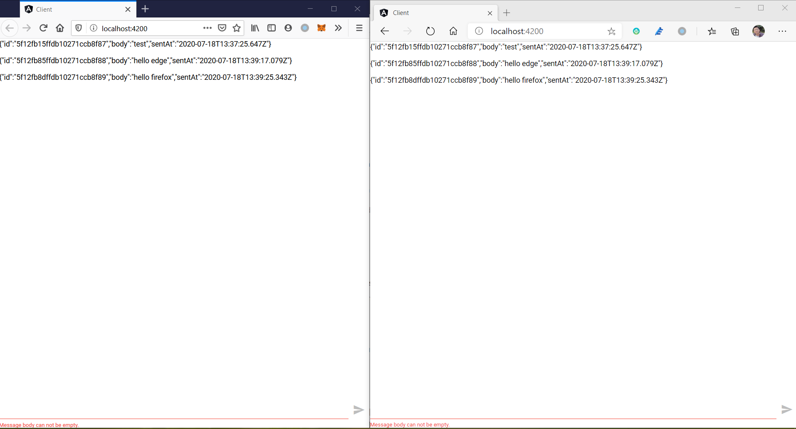

# Building a Chat application with Angular and Spring Reactive WebSocket: Part 2

In this post, we will use MongoDB capped collection instead of the Reactors [`Sinks.StandaloneFluxSink` ](https://projectreactor.io/docs/core/snapshot/api/reactor/core/publisher/Sinks.html).

If you have some experience of Linux or Unix, you must know the `tail` command. When you want to track the last n lines dynamically of some specific files, esp. the server logs while it is growing at runtime, e.g. the *access.log* file of  Apache HTTPd server. 

```bash
tail -f -n 1000 access.log
```

Similarly, Mongo provides a tailable cursor feature which acts as the tail command exactly. But there are some limitations, the tailable cursor only works on the capped collections, when a document is inserted, it will be emitted to the subscribers. A capped collection is different from a normal collection, it has a size limit of the whole collection and a maximum count of the stored documents, if the limit is reached, the old documents will be discarded. And a document can be inserted into the capped collection like the the normal one, but it can not be deleted by calling delete command.

Let's  do a small refactory on the former codes we've completed in the last post. 

Firstly add *Spring Data MongoDB Reactive* as part of dependencies.

```groovy
implementation("org.springframework.boot:spring-boot-starter-data-mongodb-reactive")
```
Add a `@Document` annotation on the Message data class.

```kotlin
@Document(collection = "messages")
data class Message @JsonCreator constructor(
        @JsonProperty("id") @Id var id: String? = null,
        @JsonProperty("body") var body: String,
        @JsonProperty("sentAt") var sentAt: Instant = Instant.now()
)
```
We specify a collection name here.

Add a Repository for the `Message` document.

```kotlin
interface MessageRepository : ReactiveMongoRepository<Message, String> {
    @Tailable
    fun getMessagesBy(): Flux<Message>
}
```

On the `getMessagesBy` method, we add a `@Tailable` annotation, which means it will use tailable cursor to retieve the `Message` documents from the **messages** collection.

Modify the `ChatSocketHandler` to the following.

```kotlin
class ChatSocketHandler(val mapper: ObjectMapper, val messages: MessageRepository) : WebSocketHandler {

    override fun handle(session: WebSocketSession): Mono<Void> {
        println("handling WebSocketSession...")
        session.receive()
                .map { it.payloadAsText }
                .map { Message(body = it, sentAt = Instant.now()) }
                .flatMap { this.messages.save(it) }
                .subscribe({ println(it) }, { println(it) })

        return session.send(
                Mono.delay(Duration.ofMillis(1000))
                        .thenMany(this.messages.getMessagesBy())
                        .map { session.textMessage(toJson(it)) }
        ).then()

    }

    fun toJson(message: Message): String = mapper.writeValueAsString(message)

}
```

When  receiving a message from client, save it into **messages** collection, at the same the server will emit the messages in **messages** collection to the client.

By default, Spring Data MongoDB does not create a *capped* collection for the `Message` document, more details please check the [Infinite stream of tailable cursors](https://docs.spring.io/spring-data/mongodb/docs/current/reference/html/#tailable-cursors) section of  Spring Data Mongo reference.

If the collection is existed, use a `convertToCapped` to convert it to *capped*.

```kotlin
@Bean
fun runner(template: ReactiveMongoTemplate) = CommandLineRunner {
    println("running CommandLineRunner...")
    template.insert(Message(body="test")).then().block()
    template.executeCommand("{\"convertToCapped\": \"messages\", size: 100000}")
    .subscribe(::println);
}
```

Else create a *capped* collection directly if it is not existed.

```kotlin
template.createCollection("messages", CollectionOptions.empty().capped().size(100000).maxDocuments(1000))
```

No need change on the client codes.

Now run the client and server applications respectively.

Open a browser add a message, you can see the changes in the **messages** collections.

Execute a query  in the mongo shell.

```bash
> db.messages.find()
{ "_id" : ObjectId("5f130da86bba28157893a9bc"), "body" : "test", "sentAt" : ISODate("2020-07-18T14:56:40.499Z"), "_class" : "com.example.demo.Message" }
{ "_id" : ObjectId("5f130dcd6bba28157893a9bd"), "body" : "test again", "sentAt" : ISODate("2020-07-18T14:57:17.858Z"), "_class" : "com.example.demo.Message" }
```

Open two browsers, try to send some messages.



It works exactly as the former version.

The complete codes is shared on my github account, check the [here](https://github.com/hantsy/angular-spring-websocket-sample) for this demo.